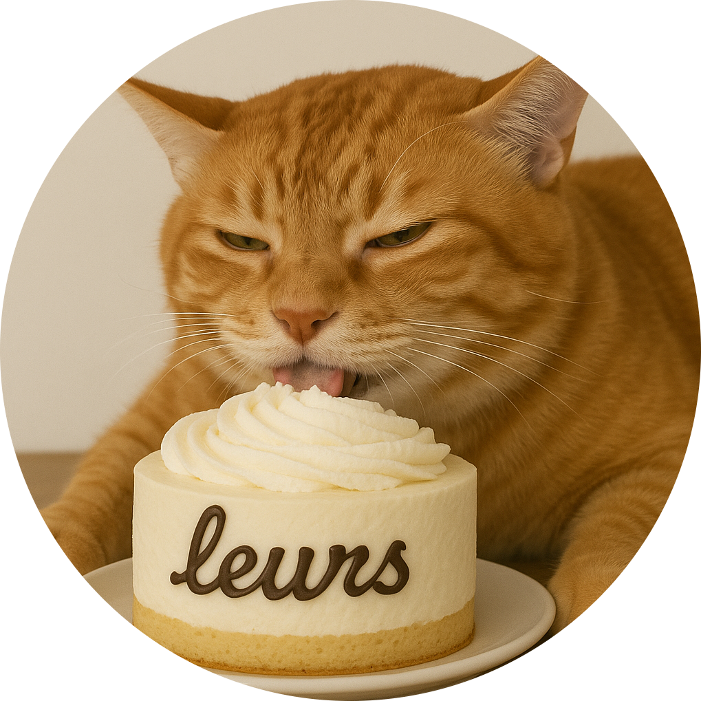

# <p align="center">Leurs - Discord Balance Bot</p>
<p align="center">
  
</p>
<p align="center">
  <strong>A feature-rich Discord bot designed to enhance your server experience.</strong>
  Complete with economy, moderation, music integration, and utility commands.
</p>
<p align="center">
  <a href="https://github.com/IM23d/leurs"></a>
  <a href="https://docs.leurs.ch/"></a>
  <a href="https://github.com/IM23d/leurs/blob/main/LICENSE"></a>
  <a href="https://github.com/IM23d/leurs/releases"></a>
</p>

---

## 🚀 Features

- **💰 Economy System**: Virtual currency, gambling, jobs, and daily rewards
- **🛡️ Advanced Moderation**: Comprehensive user management with warnings and role automation
- **🎵 Last.fm Integration**: Real-time music tracking and server-wide now playing
- **📊 Leveling System**: XP-based progression with leaderboards and rewards
- **⚙️ Admin Tools**: Custom embeds, reaction roles, and bulk management
- **🎯 Utilities**: Birthday tracking, timezone management, and quotes

## 📦 Installation

### Using Docker (Recommended)

**1. Create your configuration:**
```bash
# Clone the repository
git clone https://github.com/IM23d/leurs.git
cd leurs

# Copy and configure environment file
cp .env.template .env
# Edit .env with your bot token and API keys
```

**2. Create a `compose.yml` file:**
```yaml
services:
  leurs:
    build:
      context: .
      dockerfile: Dockerfile
    container_name: leurs-bot
    env_file:
      - .env
    restart: unless-stopped
```

**3. Start the bot:**
```bash
docker compose up -d
```

### Manual Installation

```bash
# Clone and setup
git clone https://github.com/IM23d/leurs.git
cd leurs

# Create virtual environment
python -m venv venv
source venv/bin/activate  # On Windows: venv\Scripts\activate

# Install dependencies
pip install -r requirements.txt

# Configure environment
cp .env.template .env
# Edit .env with your credentials

# Run the bot
python main.py
```

## ⚙️ Configuration

Configure your `.env` file with the following:

```properties
# Discord bot token (Required)
DISCORD_TOKEN=your_discord_bot_token

# Last.fm API (Optional - for music features)
LAST_FM_KEY=your_lastfm_api_key

# Google Custom Search API (Optional - for image search)
GOOGLE_API_KEY=your_google_api_key
GOOGLE_CSE_ID=your_google_cse_id

# DeepSeek API (Optional - for AI features)
DEEPSEEK_API_KEY=your_deepseek_api_key
```

## 🎮 Command Categories

| Category | Examples | Description |
|----------|----------|-------------|
| **Economy** | `-balance`, `-work`, `-gamble` | Manage virtual currency and jobs |
| **Moderation** | `-warn`, `-ban`, `-mute` | Keep your server organized |
| **Music** | `-np`, `-lastfm` | Share what you're listening to |
| **Levels** | `-rank`, `-leveltop` | Track your server progression |
| **Utility** | `-info`, `-birthday` | Helpful server tools |

For complete command documentation, visit **[docs.leurs.ch](https://docs.leurs.ch)**

## 🤝 Contributing

1. Fork the repository
2. Create your feature branch (`git checkout -b feature/amazing-feature`)
3. Commit your changes (`git commit -m 'Add amazing feature'`)
4. Push to the branch (`git push origin feature/amazing-feature`)
5. Open a Pull Request

## Contributors

<table>
  <tr>
    <td align="center">
      <a href="https://github.com/bettercallmilan">
        
        <br /><sub><b>Milan</b></sub>
        <br /><sub>Lead Developer</sub>
      </a>
    </td>
    <td align="center">
      <a href="https://github.com/reazndev">
        
        <br /><sub><b>Florian</b></sub>
        <br /><sub>Developer</sub>
      </a>
    </td>
    <td align="center">
      <a href="https://github.com/seakyy">
        
        <br /><sub><b>Seakyy</b></sub>
        <br /><sub>Developer</sub>
      </a>
    </td>
    <td align="center">
      <a href="https://github.com/lhilfiker">
        
        <br /><sub><b>lhilfiker</b></sub>
        <br /><sub>Contributor</sub>
      </a>
    </td>
    <td align="center">
      <a href="https://github.com/PianoNic">
        
        <br /><sub><b>PianoNic</b></sub>
        <br /><sub>Contributor</sub>
      </a>
    </td>
  </tr>
</table>

## 📄 License

This project is licensed under the MIT License - see the [LICENSE](LICENSE) file for details.

## ⭐ Support the Project

If Leurs has enhanced your Discord server experience, please consider:
- ⭐ **Starring this repository** to show your support
- 🐛 **Reporting bugs** to help us improve
- 💡 **Suggesting features** for future updates
- 🤝 **Contributing code** to make Leurs even better

## 🔗 Links

- **Documentation**: [docs.leurs.ch](https://docs.leurs.ch)
- **Issues**: [GitHub Issues](https://github.com/IM23d/leurs/issues)
- **Pull Requests**: [GitHub PRs](https://github.com/IM23d/leurs/pulls)

---

<p align="center">Made with ❤️ by the <strong>Leurs Team</strong></p>